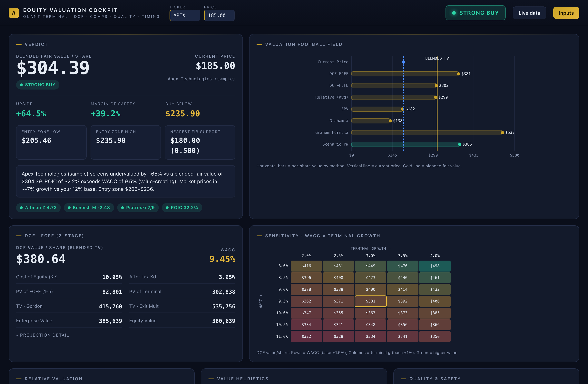
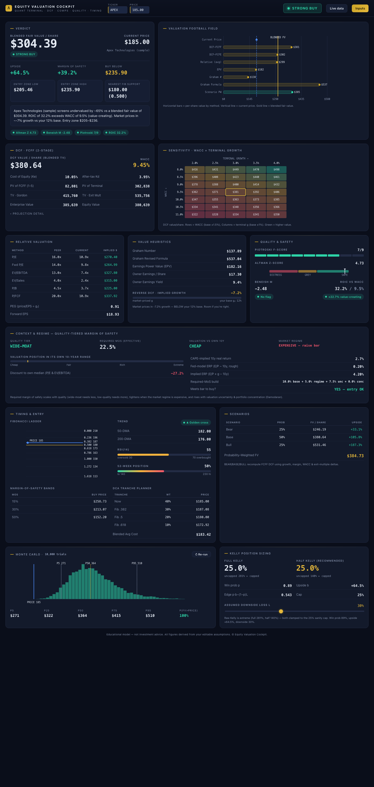

<div align="center">

# 📊 Equity Valuation Cockpit

### An investment-grade tool for deciding **what a stock is worth** — and **when it's safe to buy**

[](LICENSE)
[](#whats-inside)
[](#whats-inside)
[](#-quick-start)
[](build_excel.py)

<br/>



</div>

> [!WARNING]
> **Not investment advice.** This is a decision-support / educational tool. It quantifies *your* assumptions — garbage in, garbage out. Every example ticker uses **illustrative estimates**, not verified data. Do your own research and verify everything before risking capital.

---

## What it does

Most retail investors blur two different questions. Desks keep them apart, and so does this tool:

> **① Is it worth it?**  → intrinsic value (DCF, comps, value heuristics)
> **② When do I buy?**  → margin of safety + entry timing, scaled to *quality*

It blends a full valuation stack into a **single, quality-tiered verdict** — `STRONG BUY → BUY → HOLD/WATCH → AVOID` — and tells you the price below which it's actually safe to buy.

It ships in **two formats that run the identical math and reconcile to the cent:**

- **`equity-cockpit.html`** — a single self-contained page. No build, no dependencies, works offline. Open it and go.
- **`Equity_Valuation_Cockpit.xlsx`** — a 9-sheet Excel model with live formulas you can pick apart.

---

## ✨ Features

| | |
|---|---|
| **Discounted cash flow** | 2-stage FCFF + FCFE, WACC builder, dual terminal value (Gordon + exit multiple), WACC × growth sensitivity grid |
| **Relative valuation** | Implied price from 6 peer multiples (P/E, fwd P/E, EV/EBITDA, EV/Sales, P/B, P/FCF) + PEG |
| **Value heuristics** | Graham Number, Graham Formula, Earnings Power Value, Owner Earnings, and a **reverse-DCF** (the growth the price implies) |
| **Quality & safety** | ROIC vs WACC, Piotroski F-Score, Altman Z (distress), Beneish M (earnings manipulation) |
| **Entry timing** | Fibonacci ladder, 50/200-day MAs, RSI, 52-week position, margin-of-safety bands, 4-tranche DCA planner |
| **Risk modeling** | Bull/Base/Bear scenarios, 2,000-trial Monte Carlo distribution, Kelly position sizing |
| **Context & regime** | Valuation vs the stock's **own 10-yr range**, quality-tiered required margin of safety, CAPE/ERP market-regime dial, and Damodaran-style uncertainty + concentration scalers |
| **Live data** *(HTML)* | Optional auto-fill via your own free API key — nothing stored or hardcoded |

---

## 🚀 Quick start

**HTML** — double-click `equity-cockpit.html`. Edit the **Inputs** drawer (top-right); everything recomputes live.

**Excel** — open `Equity_Valuation_Cockpit.xlsx`. Type only into the **`ASSUMPTIONS`** sheet (every editable cell has a gold border); all other sheets are live formulas.

**Regenerate the Excel from source:**
```bash
pip install openpyxl
python3 build_excel.py        # → Equity_Valuation_Cockpit.xlsx
```

📖 Full manual: **[USER_GUIDE.md](USER_GUIDE.md)**

---

## 🧭 How the verdict works

The verdict isn't just "is it below fair value." It compares your **margin of safety** to a **required bar that adapts** — exactly how Graham, Buffett/Munger, and Damodaran describe calibrating it:

```
Required margin of safety = Quality tier   (wide-moat 10% … low-quality 50%)
                          + Market regime  (±5%: expensive vs cheap)
                          + Uncertainty    (+7.5% per level)
                          + Concentration  (+5% if you hold few names)
```

A **wonderful business needs only a small discount**; a weak or uncertain one needs a big one. That's the answer to *"by how many percent is it safe to buy."*

---

## 🔬 Validated examples *(illustrative estimates)*

The engine discriminates correctly across cheap / fair / expensive — and honestly flags its own limits:

| Ticker | Price | Fair value | Read | Verdict |
|---|--:|--:|---|---|
| **COST** | $953 | ~$323 | ~52× P/E — wonderful business, indefensible price | 🔴 Overvalued / Avoid |
| **GOOGL** | $366 | ~$184 | Top of its own range; heavy AI capex | 🔴 Overvalued / Avoid* |
| **VZ** | $47 | ~$81 | Cheap (11×) but $131B debt trips the distress gate | 🟠 Hold (risk flag)** |
| **SpaceX** | $135 | ~$7 | 94× sales, pre-profit — a venture bet no DCF can price | 🔴 Overvalued / Avoid |

<sub>\* Assumption-sensitive (AI capex). \*\* Altman Z over-penalizes levered telecoms — see Limitations. Numbers are illustrative, not advice.</sub>

<details>
<summary><b>📸 See the full dashboard</b></summary>
<br/>

</details>

---

## ⚠️ Known limitations

- **Garbage in, garbage out** — output is only as good as your inputs and growth assumptions. The tool's job is to make those explicit and stress-test them.
- **Altman Z over-penalizes telecoms/utilities** — it flags stable, investment-grade, heavily-levered firms as "distressed." Treat the risk flag as *"check the balance sheet,"* not *"bankruptcy imminent."*
- **DCF punishes heavy-capex growth** — names in a big investment phase look expensive on near-term cash flow.
- **Graham / EPV are deep-value lenses** — they'll call almost any growth stock overvalued. Re-weight them down for compounders.
- **Regime is a dial, not a timer** — CAPE/ERP predict long-run returns, not short-term tops.
- **Not built for pre-profit / story stocks** — negative-EPS IPOs break the value methods; use the reverse-DCF and scenario tabs instead.

---

## 📁 Repository structure

```
equity-cockpit.html               # self-contained web app (live demo via GitHub Pages)
Equity_Valuation_Cockpit.xlsx     # 9-sheet Excel model
Equity_Valuation_Cockpit_AAPL.xlsx# worked example (Apple, illustrative inputs)
build_excel.py / build_apple.py   # regenerate the workbook from source
USER_GUIDE.md                     # full manual
assets/                           # screenshots
```

> 💡 The HTML is fully static — enable **GitHub Pages** on this repo to host a free live demo.

---

## 📜 License

[MIT](LICENSE) — free to use, modify, and share. No warranty.

<div align="center"><sub>Built as a decision-support tool. Not investment advice. Verify everything before risking capital.</sub></div>
